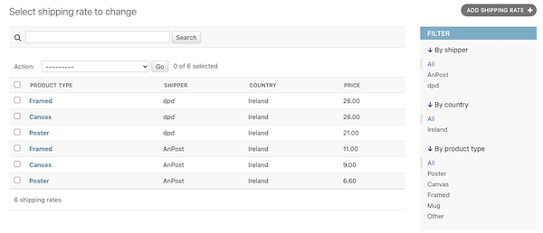
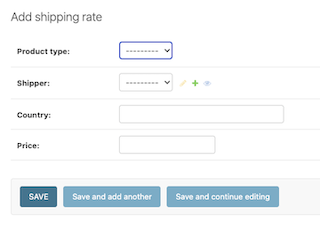

# Creative Spark Images – Photography Shop

## Table of Contents

- [About the Project](#about-the-project)
- [Features](#features)
  - [Existing Features](#existing-features)
  - [Features Left to Implement](#features-left-to-implement)
- [The Admin Panel](#the-admin-panel)
- [Security Features and Error Handling](#security-features-and-error-handling)
- [Testing](#testing)
- [Technology Stack](#technology-stack)
- [Deployment](#deployment)
- [Usage](#usage)
- [Contributing](#contributing)
- [Acknowledgements](#acknowledgements)
- [Author](#author)
- [License](#license)

---
---

## About the Project

**Creative Spark Images** is a feature-rich eCommerce web application built for photographers to sell digital and printed artworks.

Photography has always been more than just a hobby for me — it’s how I pause time, soak in the stillness of a landscape, and capture fleeting moments of beauty in nature that speak louder than words ever could. It’s a way of reconnecting with myself, especially when life feels loud. The quiet detail in a morning mist or the vibrant warmth of golden hour light — those are the moments that move me. After years of collecting these snapshots of the world around me, it felt like the right time to bring them together and share them with others who see the world a little more tenderly too. That’s how Creative Spark Images came to life.

This project is my take on a curated online photography shop — clean, modern, and calm — built with the same level of care and attention to detail I put into each image. Visitors can browse a growing gallery of images that reflect a deep love for the outdoors, and purchase either digital versions (complete with licensing) or printed formats like canvas, posters, or framed art to bring the essence of nature into their own spaces.

The entire site is crafted with intention — not just in functionality, but in feel. The interface is designed to be intuitive and clutter-free, allowing the work itself to breathe. There’s a deep sense of rhythm in the visuals and structure, making browsing feel like a meditative experience. It’s a space that feels human — made for nature lovers, fellow photographers, and anyone who finds joy in the quiet magic of the natural world.

Creative Spark Images isn’t just a portfolio or a shop — it’s a visual love letter to the world we live in. Built for explorers, artists, and nature seekers alike, this project is where tech and creativity meet in quiet harmony.

>  The live site can be found here – [Insert your deployed link here]

---
---

## Color Palette:

The color palette reflects the deep connection to nature:

- Soft sand beige (#ddd), Sonic Silver (#7c7575)and warm earth brown (#333) echo tree bark and stone
- Cool slate gray for shadows and depth
- Hints of forest green and gentle sky blue across UI highlights

Balanced by off-white tones to make every page easy on the eyes and accessible across devices
These nature-inspired hues create a grounded, peaceful atmosphere — mirroring the very environments these images come from. The goal? To invite people in, let them slow down, and experience photography the way it was meant to be felt: personally.

Behind the scenes, the project is backed by a robust Django framework — dynamic shopping bag functionality, Stripe integration, Zapier automation for email confirmations, and a thoughtfully designed order system with metadata-rich order tracking. For photographers and creators like me, the Django Admin panel is a dream to work with — intuitive, powerful, and secure.

## Fonts

In designing Creative Spark Images, the selection of Poiret One and Montserrat fonts aligns seamlessly with the project's ethos. Poiret One's sleek, geometric elegance mirrors the refined simplicity of the platform, adding a touch of sophistication that resonates with the artistic nature of the showcased photography. Its graceful curves echo the organic forms found in nature, enhancing the visual narrative of each captured moment.​

Complementing this, Montserrat's modern, geometric structure offers exceptional readability across various devices and screen sizes, ensuring a smooth and engaging user experience. Its design, rooted in urban typography, brings a contemporary flair that balances the natural themes of the artwork, bridging the gap between the digital interface and the organic subjects of the photographs.​

Together, Poiret One and Montserrat create a harmonious typographic duo that embodies the essence of Creative Spark Images—a platform where technology and creativity converge to celebrate the quiet magic of the natural world.​

---
---

## Features

- Summary:

  Users can:
  - Browse curated photographic works
  - Choose between **digital formats with licenses** or **printed formats** like canvas, poster, or framed print
  - Add products to a dynamic **shopping cart** with instant summary updates
  - Checkout securely via **Stripe**, with **automated order processing**
  - Receive confirmation emails via **Zapier** integration

  Admin users can:
  - Manage products, print types, and license types
  - Track orders via a robust **OrderModel**
  - Use Django Admin for full backend control

### Existing Features Summary

- Full product catalog and detail pages
- Format selection toggle (Digital vs Printed)
- License and print type options
- Dynamic price calculations (VAT, shipping, total)
- Custom Django template tags (`get_range`)
- Session-based shopping cart
- AJAX-based cart updates and feedback
- Stripe integration for payments
- Zapier email notifications on purchase
- Order management with unique `order_number`
- Admin control via Django backend

---

### Shopping Bag Functionality

- Display of cart items with image, title, pricing, format, license or print type
- Real-time cart updates
- Price displayed in transparent structure: subtotal, **VAT**, shipping costs and total 
- Shipper specific shipping costs (shipment via post, courier) managed via Admin Panel
- Session persistence
- Cart preview with the option to remove items with composite keys (product ID, format, license/print type)

 
 

---

### User Profile Management

The User Profile section of the application provides a clean and intuitive interface for users to manage their personal data, preferences, and order history. It complements the authentication flow handled by Django AllAuth and is visually consistent with the rest of the application’s natural and sophisticated design.

When a user signs up, a UserProfile instance is automatically created via signals (not shown here but assumed to be implemented).
The profile page is protected and only accessible to authenticated users.
Data is editable in place and saved via standard Django form POST requests.
Carousel-based layout ensures a clean, mobile-responsive way to switch between profile info and order history.

### Extended User Model:
Built using a OneToOneField relationship with Django’s built-in User model. This allows storing additional profile information such as:
- Profile picture (via Cloudinary)
- Language preference
- Full address details (country, city, street, postcode)
- Phone number

### Dynamic Carousel View

Users can toggle between:
- My Profile Details – A comprehensive form to edit personal and shipping information
- My Order History – Displays all past purchases linked to the user (fetched via reverse relation to OrderModel)

### Image Upload Support

Users can upload and update their profile picture with a custom preview display using Cloudinary and Bootstrap styling.

### Language Preference Selector

Users can choose from a list of predefined languages (English, German, French, Spanish), which can be used in the future to customize app behavior or email notifications.

### Data Validation & UX

The form uses placeholder text, Bootstrap styling, and server-side form validation to ensure clean data entry and a pleasant user experience.

### Account Deletion Request Flow

A two-step modal confirmation allows users to request account deletion while optionally submitting feedback. This is handled securely via POST requests.

### Order History Integration

The UserProfile model includes a get_order_history() method to fetch related orders from the OrderModel, making integration with the checkout system seamless.


 
 


#### User Dropdown States

 


### Checkout Flow

- Stripe Checkout Session with dynamically populated line items
- Success page clears cart and saves order
- Orders are saved with full metadata (user, total price, status)
- Secure webhook for Stripe confirmations

---
---

## Features Left to Implement

- Rating and comment system for products
- Image zoom/lightbox on product detail
- SEO optimization and sitemap auto-generation
- Instagram feed integration

---
---

## The Admin Panel

- Summary:

  Admins can:
  - Add/edit products, licenses, and print types
  - View and manage orders via OrderModel
  - Manage stock levels
  - Add featured products and promotions

  Admin is enhanced with:
  - Crispy forms
  - Status filters
  - Automated `order_number` generation

---
---

## Security Features and Error Handling

## Security Features

Security has been a central concern in the development of this application — especially given that it involves user authentication, digital transactions through Stripe, and sensitive user data. The system is built using Django's robust security tools, enhanced with thoughtful implementation to create a secure, trustworthy, and seamless shopping experience.

This project adopts a defensive development strategy, focusing on data integrity, user protection, and controlled access throughout the site. Sensitive workflows such as checkout, Stripe payments, and account handling are fortified with proven security best practices.

### Authentication & Authorization

- **Django's built-in authentication system** is used to enforce user authentication.
- Role-based access control (**RBAC**) differentiates **normal users, staff, and superusers** to limit permissions accordingly.
- **Session expiration & inactivity logout** prevent unauthorized access if a session remains idle for too long.
- **Two-factor authentication (2FA)** can be integrated for additional security.

### **User Management & Account Security**
- **Password hashing using Django’s PBKDF2 algorithm** (configurable with bcrypt, Argon2, or SHA-256) to secure stored credentials.
- **Brute-force protection** via login attempt throttling to prevent repeated unauthorized login attempts.
- Users must use **strong passwords**, enforced through Django’s built-in **password validators**.
- **Email verification** is required for new account activation and password resets.
- **Cross-Site Request Forgery (CSRF) protection** is enabled for all sensitive user actions.

### Form & Input Validation

- All form inputs are cleaned and validated before saving to the database.
- CSRF protection is enforced via Django’s automatic CSRF token inclusion on all forms to prevent cross-site attacks.
- The system uses try-except blocks to gracefully catch and handle edge cases like invalid quantity or missing data during form submission.

### Stripe Integration Security

- The Stripe payment gateway is integrated using environment variables to protect secret keys.
- Stripe checkout sessions are server-side generated, ensuring users cannot manipulate payment data client-side.
- All sensitive payment interactions happen on Stripe’s secure hosted pages, reducing PCI compliance risks.

### Data Protection & ORM Use

- **Form validation** prevents SQL injection, XSS (Cross-Site Scripting), and malicious inputs.
- All input fields are sanitized before being stored in the database.
- **Django ORM (Object-Relational Mapping)** is used instead of raw SQL queries to prevent SQL injection attacks.
- **File uploads are restricted** to specific formats, and **size limits** are set to prevent abuse.
- **Sensitive data is encrypted** before being stored, using Django’s **encrypted fields** or third-party libraries like **Fernet encryption**.

### Admin Panel Security

- **Admin panel access is restricted** to superusers and staff members.
- **Recent admin actions are logged**, allowing audits for tracking changes.
- **Bulk actions (delete, approve, mark verified)** require confirmation to prevent unintended modifications.
- **Only verified email addresses** can be assigned as primary to prevent account impersonation.
- **Superusers receive notifications for suspicious activity** within the admin panel.

### **Database Integrity Protection**
- **Foreign key constraints** ensure related data is properly linked and prevent orphan records.
- **Transactional integrity** is enforced using Django’s **atomic transactions** to prevent partial data updates in case of failure.
- **Backups & automatic rollbacks** are scheduled to recover from accidental data loss or corruption.

### **Logging & Monitoring**
- **Django’s logging framework** is configured to track authentication attempts, errors, and suspicious activity.
- **Error logs are monitored in real-time**, and alerts are triggered for repeated failed login attempts or unusual API usage.
- **Third-party security monitoring tools**, such as Sentry, can be integrated to capture and analyze security breaches.

### Other Protections

- Hidden form fields are validated server-side to ensure users don’t manipulate hidden product configuration values like license type or print format.
- Checkout sessions are cleared immediately after successful order placement, preventing re-submission or reuse of the cart.
- Null-safe access to all optional values (e.g., license or print_type) prevents unexpected crashes in cart or checkout logic.

---

## Error Handling

This project uses clear, user-friendly messaging and fallback logic to maintain a smooth experience, even when unexpected errors occur.


### **Form & Input Validation Errors**

- User input validation provides **real-time feedback** to prevent incorrect submissions.
- Custom **error messages** guide users toward resolving input issues.
- **Try-except blocks** handle unexpected form errors gracefully.

### **Authentication & Access Errors**

- Unauthorized users attempting to access restricted pages are **redirected to the login page with an error message**.
- **403 Forbidden and 401 Unauthorized responses** are properly returned in the API when access is denied.
- **Invalid login attempts are logged**, and users are notified of suspicious login activity.
- **Attempts to bypass restrictions** are gracefully denied with messages, not crashes.

### **Database & Model Errors**

- **Atomic transactions** prevent database corruption by rolling back failed operations.
- **Custom error handlers** catch and display meaningful error messages when database operations fail.
- **Graceful handling of missing database records**, preventing "DoesNotExist" exceptions.

### Fallback for Missing Data

- If product data or stock details are missing, users are shown friendly warnings rather than raw errors.
- The system validates session data before using it, preventing “NoneType” or invalid cast exceptions.

---
---

## Page Performance

  ### Mobile

- Home Page


- Category Page


- Recipe Detail Page


- About Page


- Weekly Tip


- Page for Login / Logout / Sign-Up


  ### Desktop

- Home Page


- Category Page


- Recipe Detail Page


- About Us Page


- Contact Page


- Page for Login / Logout / Sign-Up


---
---

## Testing

### Manual Testing

To catch and be able to reverse an action before being forced to wipe the database I made sure to strictly following the concept of model first and test the functionality with print statements to the terminal and compiling a tests file for each app.

I confirmed that all errors caused by user action are handeled the expected way and the corresponding feedback messages are given to the user by entering invalid inputs

- Add to cart (with/without license or print type)
- Remove from cart
- Quantity updates
- Stripe checkout end-to-end
- Webhook confirmation with test payloads
- Error message display for edge cases
- Missing print type/stock/out of range conditions

I had content reviewed by test users so I catch and fix typos and/or grammar errors.

I thoroughly tested all buttons, carousel and scroll-down-icon on both mobile devices, tablets and desktop.

Together with my test users (age 25 - 74) I reviewed the content on different devices to ensure all of the content is displayed as expected.

---

### Automated Testing

- Pylint/Flake8 compliance (PEP8 style fixes implemented)
- Unit tests on views and utility functions (`calculate_total_price`)
- Repeated regression testing after bag and checkout integration

---

### Test Report Django

  ```bash
  shop/tests/test_models.py
  Found 6 test(s).
  Creating test database for alias 'default'...
  System check identified no issues (0 silenced).
  ......
  ----------------------------------------------------------------------
  Ran 6 tests in 3.395s

  OK


  user_profiles/tests/test_models.py

  Found 3 test(s).
  Creating test database for alias 'default'...
  System check identified no issues (0 silenced).
  ...
  ----------------------------------------------------------------------
  Ran 3 tests in 1.575s

  OK


  user_profiles/tests/test_admin.py

  Found 1 test(s).
  Creating test database for alias 'default'...
  System check identified no issues (0 silenced).
  .
  ----------------------------------------------------------------------
  Ran 1 test in 1.659s

  OK


  user_profiles/tests/test_form.py

  Found 2 test(s).
  Creating test database for alias 'default'...
  System check identified no issues (0 silenced).
  ..
  ----------------------------------------------------------------------
  Ran 2 tests in 0.451s

  OK


  user_profiles/tests/test_views.py

  Found 2 test(s).
  Creating test database for alias 'default'...
  System check identified no issues (0 silenced).
  ..
  ----------------------------------------------------------------------
  Ran 2 tests in 2.647s

  OK

  user_profiles/tests/test_signals.py

  Found 2 test(s).
  Creating test database for alias 'default'...
  System check identified no issues (0 silenced).
  ..
  ----------------------------------------------------------------------
  Ran 2 tests in 0.987s

  OK


  Final test after implementing all features

  Found 10 test(s).
  Creating test database for alias 'default'...
  System check identified no issues (0 silenced).
  ..........
  ----------------------------------------------------------------------
  Ran 10 tests in 8.551s

  OK
  ```

---
---

### Bugs and Resolutions

  ### Bugs and Resolutions

  | Bug / Issue | Description | Resolution |
  |-------------|-------------|------------|
  | `ModuleNotFoundError` for `bag.context_processors` | Typo in the context processor path led to an internal server error on homepage load. | Corrected the import path in `settings.py` to properly reference `bag.context_processors.bag_contents`. |
  | Quantity was not passed in `POST` request | Resulted in `NoneType` error during `add_to_bag` view. | Added a hidden quantity field and ensured `name="quantity"` was included in the form. |
  | Incorrect `if` template logic in `bag.html` | Used `` without a condition, causing a TemplateSyntaxError. | Replaced `` with `` to correctly handle the conditional. |
  | Printed product was added as digital | Format input was not updated when selecting "Printed Product". | Ensured `formatInput.value` is updated in the JS toggle logic and added the `formatInput` field inside the `<form>`. |
  | Remove button in bag failed | Reverse URL lookup for `remove_from_bag` failed due to incorrect argument. | Updated `remove_from_bag` view to use composite `item_key` and passed it correctly in the template with ``. |
  | Print type showed as "None" | Printed product selection was not saved properly. | Corrected logic in view to capture and store the print type string instead of its raw or empty value. |
  | Duplicate field assignments | Variables like `product_format`, `license_id` were declared twice. | Cleaned up `add_to_bag` view to assign each value once and added necessary try-except blocks for safety. |
  | Quantity not accumulating | Items were overwritten instead of updated when re-added. | Switched from product ID key to composite `item_key` in the session to distinguish variations. |
  | Facebook page not linked correctly in Instagram | Page didn’t show under Accounts in Instagram. | Resolved via Meta’s **Accounts Center** by properly connecting Facebook Page under "Connected Experiences". |
  | Stripe `checkout_success` crashed on OrderModel save | `user_id` was missing due to anonymous session. | Required login before checkout and passed `request.user` when saving the order. |
  | `product_format` showed as `None` in bag | JS toggle logic did not update hidden input properly. | Ensured `formatInput.value` is correctly set on both radio button changes. |
  | Shopping bag displayed nothing after adding product | Key logic broke due to mismatch between view and template. | Made sure both view and template used the same composite `item_key` structure. |
  | View crashed due to `b` typo | Typo in `remove_from_bag` function: `b else:` instead of `else:`. | Fixed syntax error by removing stray character and fixing indentation. |
  | Order total recalculated incorrectly in checkout | View re-calculated totals instead of using pre-calculated bag data. | Added session-level calculation and passed it to OrderModel creation. |
  | `request.user` not passed in `OrderModel` | Attempted to save an order without an authenticated user. | Added `login_required` decorator to ensure only logged-in users can complete checkout. |
  | Stripe webhook email not received | Email address was missing from test payload. | Ensured `customer_email` was included in Stripe session and template. |
  | `Uncaught TypeError: Cannot read properties of null (reading 'style')` | JavaScript attempted to access `.style` on DOM elements that were not present on some pages (e.g., `#backToTop`, `#message-container`). | Added `if (element)` checks before accessing `.style` or attaching event listeners to ensure scripts run safely across all pages. |


---
---

## Technology Stack

- **Backend:** Python 3, Django 4.2
- **Frontend:** HTML5, CSS3, Bootstrap 5, JavaScript
- **Database:** PostgreSQL
- **Media Hosting:** Cloudinary
- **Payment Integration:** Stripe
- **Email Notifications:** Zapier + SendGrid
- **Deployment:** Heroku

---
---

## Code Quality and Version Control

- PEP8 Compliance: The code has been checked against PEP8 standards using .Flake8, .autopep8 and Pylint

- Comments: Functions and classes include docstrings to describe their purpose, inputs, and outputs.

- Version control is managed using Git and GitHub, with a focus on maintaining a clean and organized history. Regular commits follow a consistent format and describe the features implemented and/or reasons for changes made to existing features.

---
---

## Deployment

This project is hosted on Heroku

  **Fork or Clone the repository**

1. Clone the repo:
    ```bash
    git clone https://github.com/yourusername/creative-spark-images
    cd creative-spark-images

2. Create a virtual environment:
    ```bash
    python3 -m venv .venv
    source .venv/bin/activate

3. Install dependencies:
    ```bash
    pip install -r requirements.txt

    # List of dependencies
    asgiref==3.8.1
    bleach==6.2.0
    certifi==2025.1.31
    cffi==1.17.1
    charset-normalizer==3.4.1
    cloudinary==1.36.0
    crispy-bootstrap5==0.7
    cryptography==44.0.2
    defusedxml==0.7.1
    dj-database-url==0.5.0
    dj3-cloudinary-storage==0.0.6
    Django==4.2.20
    django-admin-list-filter-dropdown==1.0.3
    django-allauth==0.57.2
    django-countries==7.2.1
    django-crispy-forms==2.3
    django-summernote==0.8.20.0
    gunicorn==20.1.0
    idna==3.10
    oauthlib==3.2.2
    packaging==24.2
    psycopg2-binary==2.9.10
    pycparser==2.22
    PyJWT==2.10.1
    python3-openid==3.2.0
    requests==2.32.3
    requests-oauthlib==2.0.0
    setuptools==75.8.2
    six==1.17.0
    sqlparse==0.5.3
    stripe==11.6.0
    typing_extensions==4.12.2
    urllib3==1.26.20
    webencodings==0.5.1
    whitenoise==6.5.0


4. Set up .env with:
    ```bash
    SECRET_KEY=
    DEBUG=False
    DATABASE_URL=
    STRIPE_PUBLIC_KEY=
    STRIPE_SECRET_KEY=
    STRIPE_ENDPOINT_SECRET=
    CLOUDINARY_URL=

5. Apply migrations:
    ```bash
    python3 manage.py makemigrations
    python3 manage.py migrate

6. Collect static files:
    ```bash
    python3 manage.py collectstatic

7. Create a PPROCFILE:
    ```bash
    python manage.py > Procfile

8. in settings.py
    ```bash
    DEBUG = FALSE

8. Deploy to Heroku or similar:
    ```bash
    Set up environment variables in Heroku dashboard
    Link GitHub repo
    Enable automatic deploys

> The live link can be found here: 

---
---

## Usage

  - Launch the site and browse the gallery
  - Select a product, choose format and quantity
  - Add to cart and proceed to secure checkout
  - Receive confirmation and follow-up via email

---
---

## Contribution

  - Fork the repo
  - Create a new branch (git checkout -b feature-name)
  - Make your changes
  - Commit (git commit -m 'Add feature')
  - Push to branch (git push origin feature-name)
  - Open a Pull Request

---
---

## Acknowledgements

### Content

- Stripe Docs for checkout and webhooks
- all legal documents, T&C and policy documents are taken from my existing shop with Picfair whcih this new shop is going to replace
- Stack Overflow and Django community for troubleshooting
- Code Institute project templates for structure inspiration [p3-template](https://github.com/Code-Institute-Org/p3-template)

### Media
- placeholder images:  Freepik https://www.freepik.com/free-photos-vectors
- Icons from my Icon Kit on [font-awesome](https://fontawesome.com/icons)
- all images and videos are my own

---
---

## Author

- [merzann](https://github.com/merzann)

---
---

## License
[](LICENSE.md)