# Creative Spark Images – Photography Shop

## Table of Contents

- [About the Project](#about-the-project)
- [Features](#features)
  - [Existing Features](#existing-features)
  - [Features Left to Implement](#features-left-to-implement)
- [The Admin Panel](#the-admin-panel)
- [Security Features and Error Handling](#security-features-and-error-handling)
- [Testing](#testing)
- [Technology Stack](#technology-stack)
- [Deployment](#deployment)
- [Usage](#usage)
- [Contributing](#contributing)
- [Acknowledgements](#acknowledgements)
- [Author](#author)
- [License](#license)

---
---

## About the Project

**Creative Spark Images** is a feature-rich eCommerce web application built for photographers to sell digital and printed artworks.

Photography has always been more than just a hobby for me — it’s how I pause time, soak in the stillness of a landscape, and capture fleeting moments of beauty in nature that speak louder than words ever could. It’s a way of reconnecting with myself, especially when life feels loud. The quiet detail in a morning mist or the vibrant warmth of golden hour light — those are the moments that move me. After years of collecting these snapshots of the world around me, it felt like the right time to bring them together and share them with others who see the world a little more tenderly too. That’s how Creative Spark Images came to life.

This project is my take on a curated online photography shop — clean, modern, and calm — built with the same level of care and attention to detail I put into each image. Visitors can browse a growing gallery of images that reflect a deep love for the outdoors, and purchase either digital versions (complete with licensing) or printed formats like canvas, posters, or framed art to bring the essence of nature into their own spaces.

The entire site is crafted with intention — not just in functionality, but in feel. The interface is designed to be intuitive and clutter-free, allowing the work itself to breathe. There’s a deep sense of rhythm in the visuals and structure, making browsing feel like a meditative experience. It’s a space that feels human — made for nature lovers, fellow photographers, and anyone who finds joy in the quiet magic of the natural world.

Creative Spark Images isn’t just a portfolio or a shop — it’s a visual love letter to the world we live in. Built for explorers, artists, and nature seekers alike, this project is where tech and creativity meet in quiet harmony.

>  The live site can be found here – [Insert your deployed link here]

---
---

## Features

- Summary:

  Users can:
  - Browse curated photographic works
  - Choose between **digital formats with licenses** or **printed formats** like canvas, poster, or framed print
  - Add products to a dynamic **shopping cart** with instant summary updates
  - Checkout securely via **Stripe**, with **automated order processing**
  - Receive confirmation emails via **Zapier** integration

  Admin users can:
  - Manage products, print types, and license types
  - Track orders via a robust **OrderModel**
  - Use Django Admin for full backend control

### Existing Features Summary

- Full product catalog and detail pages
- Format selection toggle (Digital vs Printed)
- License and print type options
- Dynamic price calculations (VAT, shipping, total)
- Custom Django template tags (`get_range`)
- Session-based shopping cart
- AJAX-based cart updates and feedback
- Stripe integration for payments
- Zapier email notifications on purchase
- Order management with unique `order_number`
- Extendable language selection menu (currently implemented: EN/planned: DE,ES,FR)
- Admin control via Django backend

---

## Color Palette:

The color palette reflects the deep connection to nature:

- Soft sand beige (#ddd), Sonic Silver (#7c7575)and warm earth brown (#333) echo tree bark and stone
- Cool slate gray for shadows and depth
- Hints of forest green and gentle sky blue across UI highlights

Balanced by off-white tones to make every page easy on the eyes and accessible across devices
These nature-inspired hues create a grounded, peaceful atmosphere — mirroring the very environments these images come from. The goal? To invite people in, let them slow down, and experience photography the way it was meant to be felt: personally.

Behind the scenes, the project is backed by a robust Django framework — dynamic shopping bag functionality, Stripe integration, Zapier automation for email confirmations, and a thoughtfully designed order system with metadata-rich order tracking. For photographers and creators like me, the Django Admin panel is a dream to work with — intuitive, powerful, and secure.

---

## Fonts

In designing Creative Spark Images, the selection of Poiret One and Montserrat fonts aligns seamlessly with the project's ethos. Poiret One's sleek, geometric elegance mirrors the refined simplicity of the platform, adding a touch of sophistication that resonates with the artistic nature of the showcased photography. Its graceful curves echo the organic forms found in nature, enhancing the visual narrative of each captured moment.​

Complementing this, Montserrat's modern, geometric structure offers exceptional readability across various devices and screen sizes, ensuring a smooth and engaging user experience. Its design, rooted in urban typography, brings a contemporary flair that balances the natural themes of the artwork, bridging the gap between the digital interface and the organic subjects of the photographs.​

Together, Poiret One and Montserrat create a harmonious typographic duo that embodies the essence of Creative Spark Images—a platform where technology and creativity converge to celebrate the quiet magic of the natural world.​

---

## The Logo

The Creative Spark Images logo is more than just a visual mark — it's a reflection of the soul behind the lens. The sketched figure of a woman holding a camera isn't just any figure; it's a stylized self-portrait — a symbolic representation of the creator herself.

With flowing hair and a quiet, focused gaze, the woman in the logo captures the meditative stillness that defines much of my photography. The camera in hand is both a tool and a metaphor — a means of connection, presence, and storytelling. This artistic sketch bridges the digital and natural worlds, just as Creative Spark Images blends technology with emotion and intention.

The elegant, handwritten-style typography of Creative Spark Images mirrors the thoughtful and creative nature of the work — soft, expressive, and inviting. It evokes a personal signature, reminding viewers that this isn’t just a brand — it’s an extension of a lived artistic journey.

Everything about the logo — from its monochrome simplicity to the organic curves — echoes the brand's core philosophy: to create a space that feels both curated and deeply human. It's a gentle nod to the artist behind the scenes, her relationship with nature, and the quiet beauty captured through the lens.

This logo is not just a visual identity — it's a moment, a mood, and a mirror of the artist's spirit. It invites the viewer into a world where photography becomes more than images — it becomes experience, reflection, and connection.


---
---

## The Homepage

The homepage of Creative Spark Images acts as a narrative-driven landing page blending visual storytelling, interactive transitions, and practical navigation. It sets the tone for the brand’s aesthetics while guiding users towards the gallery, store, or About-Us-section with cinematic flair and UX clarity.


### Features & Functionality

#### Homepage part 1: Hero Section with Background Video
- Full-screen looping background video (`sunny_day_in_waterville.mp4`) of Ballinskelligs Bay.
- Overlay text highlights:
  - `Nature & Wildlife Photography`
  - `Experimental Photography`
  - `Landmarks`
  - `Historical Sites`

**Special Offer Display**
- A **wooden signboard** graphic shows the current `SpecialOffer`, conveying a feeling of actually being at a real location in Ireland.
- Dynamically rendered using:
  - **Offer Text** (`safe`-rendered HTML from admin input)
  - **Countdown Timer** (`data-expiry` handled via JS)
- Logic managed in `apply_special_offer()` from `checkout/views.py`:
  - Free Shipping
  - % General discounts
  - % Discount on products of a specific theme
  - Buy X Get Y Free

**Road Signs Navigation**
- The two interactive road signs further support the feeling of actually being at a real location.
  - **Gallery**: triggers animation and redirect
  - **About Us**: scrolls smoothly to the about section

**Animated Gallery Entrance**
  - Clicking “Gallery” fades out the intro section and plays `cottage-animation.mp4`.
  - Overlay welcome message appears and fades.
  - After ~6 seconds, user is redirected to `/shop/gallery/`.
  - The animation can be skipped by selecting 'Gallery -> Images by Theme' from the Menu in the Navbar which takes the User directly to the gallery room

**Audio Toggle**
  - Walking sound plays during animation (`walking-on-gravel.mp3`).
  - Easy accessible toggle button (🔇 / 🔊).

---

#### Navigation & UX Considerations

| Element               | Destination / Functionality                                     |
|-----------------------|-----------------------------------------------------------------|
| **Gallery Sign**      | Triggers animation, redirects to `/shop/gallery/`               |
| **About Us Sign**     | Scrolls smoothly to `#about-section`                            |
| **Back to Top Button**| Scrolls to `#intro` section                                     |
| **Navbar Links**      | Skip animation, direct access to views like "Gallery by Theme"  |
| **Accessibility**     | Aria-label and aria-labledby attributes on all main sections and clickable elements ensure accessibilty requirements are met |

---

#### UX Design Principles

- Cinematic animation enhances storytelling.
- Scroll interactions guide users naturally through content.
- Real-world visual metaphors for signs and boards.
- All interactions remain accessible and responsive.

---

#### Backend Integration

- Homepage content is fully dynamic:
  - `AboutUs` content via Django Admin + Summernote.
  - `SpecialOffer` logic includes:
    - Expiry date filtering
    - Conditional display
    - Bag-level modifications during checkout

- Countdown managed with JavaScript using `data-expiry` rendered server-side.

---

### About us section

The About section tells a heartfelt story of chasing golden light, capturing nature’s beauty, and transforming those moments into prints and calendars — blending art, adventure, and authenticity. A warm, sunset-lit profile photo the owner of the shop, the passionate eye behind Creative Spark Images.

#### Features

  - Dynamically displays content from the Django Admin (`AboutUs` model).
  - Responsive card layout with image and rich text formatting.
  - Positioned directly below the intro section.
  - Clean separation of layout and behavior via HTML, CSS, and JS.
  - CSS handles animations and positioning.
  - JavaScript uses `DOMContentLoaded` to ensure timing and availability of DOM elements.
  - Fully responsive and mobile-compatible design.

**About Us Navigation (Road Sign)**
  - Clickable **“About Us” road sign** on the homepage scrolls the user smoothly to the About section.
  - Uses `scrollIntoView` for a polished UX.
  - Provides intuitive and quick access without reloading or navigating away.

**Back to Top Button**
  - Smoothly scrolls the user back to the top of the page.
  - Fully accessible with `aria-label` and hover state.

**content Management**
  - profile image and content are managed from the Backend through the Admin Panel

---

**UX Considerations**
  - Consistent scrolling behavior for both the About and Back-to-Top buttons.
  - Intro section reappears on scroll-up if it was previously hidden (e.g., by gallery animation).
  - Elegant appearance matching the site's brand — including text shadow, elegant fonts, and card layout.
  - Fallback image used when no About image is provided.
  - The installation of summernote allows users to include rel-attributes into their content


---
---

## Navbar

### Menu

---

### Logo

The 'home'-url anchored to logo allows the user to return to the home page from any point within the web application.

---

### User dropdown menu

<u>Dropdown States:</u>

When no user is signed the following options are displayed:

- **Create an account:** Allows the user to to create an account using the customised Django Sign up template.

- **Login:** Allows the user to log in using the customised Django Login Template.

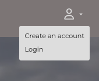

When the user is logged in the following options are displayed:

- **My Profile**: allows the user to access their user profile and update their information or delete their profile or view their order history
- **Order History:** provides direct access to the order history
- **Logout:** allows the user to log out and continue to browse the page as guest

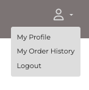

---

### Access to Shopping Cart

The shopping cart allows the user to access their shopping bag from any point within the application. Added items are counted in realtime and the counter updates accordingly informing the user about the number of items currently added to the bag.


---

### Extendable language selection dropdown menu

The language menu includes four of the most commonly understood languages in Europe, the future target market of Creative Spark Images: English, French, German and Spanish. Currently fully implmeneted is English.

A dynamic multilingual placeholder page was implemented to inform users when a language-specific version of the site is not yet available.

<u>Languages Supported:</u>
  - English (default fallback)
  - German
  - French
  - Spanish


---
---

### Shopping Bag 

A polished, user-friendly feature that dynamically adapts to product configurations, provides transparency in costs, and enforces validation to reduce user error or skipped inputs.

**Summary**
- **Display of cart items** including image, title, pricing, format, and either license or print type.
- **Real-time cart updates** without page reloads, thanks to smart JavaScript event listeners.
- **Transparent pricing structure**:
  - Subtotal (excl. VAT)
  - VAT (dynamically fetched from `CountryVAT`)
  - Shipping (based on `ShippingRate` model)
  - Grand total (incl. VAT and shipping)
- **Country-specific VAT** and **shipper-specific shipping costs** handled dynamically via Admin Panel.
- **Session-based persistence** of bag items and totals.
- **Composite key system** ensures unique identification of item configurations (e.g. same product with different formats or licenses).
- **Form-based cart item updates**, including quantity, format, and print type.
- **Responsive layout** with special UX handling on small screens (buttons stacked vertically).

---

### Structure & Components

#### From the User's perspective

Upon opening the shopping cart, users are greeted with a clean, visually structured layout that displays every product they’ve added to their bag. Each item is accompanied by:

- A **thumbnail image** (takes up 50% of form height),
- The **product title**,
- A **Format dropdown** (Digital or Printed),
- A **Quantity selector** (1–10),
- A **Print Type selector** (if Printed is chosen),
- A **Subtotal display** (based on quantity × unit price),
- **two buttons for making changes to the shopping cart content**: `Update` and `Remove`.
- **two buttons to navigate back to the gallery and checkout**: `Continue Shopping` and `Proceed to Checkout`

**Smart Behavior:**
- If the user switches from Digital to Printed, the *Print Type* dropdown appears automatically.
- The **Update** and **Proceed to Checkout** buttons are automatically disabled when necessary **preventing the user from proceeding** until all changes made to items in the bag are confirmed
- An inline warning informs users if any updates still need confirmation.

This provides clarity and control while avoiding any accidental submissions with incomplete data.

**User Experience Highlights:**
- Immediate visual feedback on updates.
- No reloads needed to change format, quantity, or type.
- Responsive layout: buttons adapt on mobile and desktop.
- Intuitive validation logic — the user is guided without error popups.
- Checkout is blocked until all edits are finalized, reducing potential errors and mismatched pricing.
- Easy navigation back to Gallery Page and Checkout
- Real-time count of items in the shopping bag displayed by item counter in Navbar

---

### Technical Structure & Functionalities

- **Session Management:** All bag data is stored in `request.session`, with `view_bag`, `add_to_bag`, `update_bag_item`, and `remove_from_bag` views handling logic.
- **Composite Keys:** Each bag item is uniquely identified by a key composed of `product_id`, `format`, and either `license` or `print_type`, ensuring no collisions between digital and printed variants.
- **Country-Specific VAT:** Pulled from `CountryVAT` model using session-stored country; fallback to 21% VAT.
- **Shipping Lookup:** Pulled dynamically from the `ShippingRate` model using mappings like `PRINT_TYPE_TO_SHIPPING_TYPE`.
- **JS Logic:** Enables/disables buttons based on form state and input changes using `data-` attributes and live listeners.

---

### Security & UX Defenses

| Type                          | Feature                                                                 |
|-------------------------------|-------------------------------------------------------------------------|
| Input Validation              | Ensures quantity is within 1–10 and format is selected correctly        |
| Disabled Buttons              | Prevents proceeding to checkout without confirmed changes               |
| Conditional Logic             | Print types only shown if format is `printed`                           |
| Server-Side Validation        | Final `POST` checks in views for invalid data before updating session   |
| Session Integrity             | Session-based cart data avoids DB bloat and maintains user state        |

---

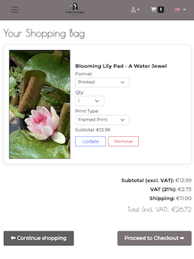

---

### User Profile Management

The User Profile section of the application provides a clean and intuitive interface for users to manage their personal data, preferences, and order history. It complements the authentication flow handled by Django AllAuth and is visually consistent with the rest of the application’s natural and sophisticated design.

When a user signs up, a UserProfile instance is automatically created via signals (not shown here but assumed to be implemented).
The profile page is protected and only accessible to authenticated users.
Data is editable in place and saved via standard Django form POST requests.
Carousel-based layout ensures a clean, mobile-responsive way to switch between profile info and order history.

### Extended User Model:
Built using a OneToOneField relationship with Django’s built-in User model. This allows storing additional profile information such as:
- Profile picture (via Cloudinary)
- Language preference
- Full address details (country, city, street, postcode)
- Phone number

### Dynamic Carousel View

Users can toggle between:
- My Profile Details – A comprehensive form to edit personal and shipping information
- My Order History – Displays all past purchases linked to the user (fetched via reverse relation to OrderModel)

### Image Upload Support

Users can upload and update their profile picture with a custom preview display using Cloudinary and Bootstrap styling.

### Language Preference Selector

Users can choose from a list of predefined languages (English, German, French, Spanish), which can be used in the future to customize app behavior or email notifications.

### Data Validation & UX

The form uses placeholder text, Bootstrap styling, and server-side form validation to ensure clean data entry and a pleasant user experience.

### Account Deletion Request Flow

A two-step modal confirmation allows users to request account deletion while optionally submitting feedback. This is handled securely via POST requests.

### Order History Integration

The UserProfile model includes a get_order_history() method to fetch related orders from the OrderModel, making integration with the checkout system seamless.

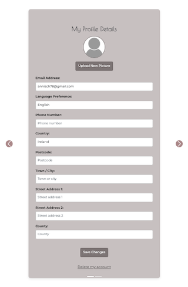
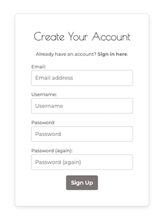 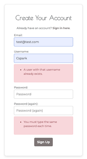
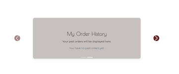

---
---

### Secure Checkout Flow

**UX Highlights**
  - Intuitive Progress Tracker: Clearly indicates the current step and overall progress.
  - Auto-Fill & Change Detection: Ensures returning users see their stored details while also tracking unsaved edits.
  - Modal Dialog: Reduces accidental overwrites by confirming save actions.
  - Graceful Fallback: Users can cancel edits and revert to original data without reloading the page.
  - Responsive & Accessible: Form labels, ARIA attributes, and input feedback ensure accessibility compliance.

---

### Step 1: Contact details

**Dual Entry Paths:**
  - Authenticated Users: See a pre-filled contact form with their saved profile data.
  - Guest Users: Choose to proceed with a simplified contact form to check out without logging in.

**Profile Management:**
  - Authenticated users can update their first name, last name, and email directly from the checkout form.
  - Guest users can enter their information and optionally create a temporary account with auto-login for convenience.

**Modal Confirmation:**
  - Users are prompted with a modal asking whether to save changes before proceeding.
  - Options: Save, Don't Save, or Cancel, giving users full control over profile updates.

**Dynamic Form Behavior:**
 - For guests, the Continue button is disabled until all form fields are valid (including correct email format).
 - For returning users, changes are tracked and compared to original data to detect modifications.
 - Real-time visual feedback allows user to easily identify errors in data provided 

**Security & UX Defenses**

| Type                          | Feature                                                                 |
|-------------------------------|-------------------------------------------------------------------------|
| CSRF Protection               | All form submissions include CSRF tokens and are verified server-side.  |
| Secure Guest Accounts         | Guest users are auto-created with random usernames and passwords.       |
| Backend Validation            | All submitted data is sanitized and validated before saving.            |
| Frontend Validation           | Email field uses regex and required attributes for early validation.    |
| Live Feedback	                | Real-time visual validation with Bootstrap classes (is-valid/is-invalid).|
| Session Management            | Guest users are securely authenticated via Django’s `login()` function. |
| Modal Confirmation            | Users must confirm intent before profile data is changed.               |
| Revert Unsaved Edits          | Canceling/discarding changes reverts fields to their original values.   |
| Disabled Buttons              | "Continue" is only enabled when inputs are valid and complete.          |
| Progressive Disclosure        | Guest form is hidden by default until selected to minimize noise.       |
| ARIA & Label Compliance       | All fields include ARIA attributes for better accessibility.            |

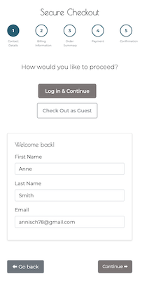 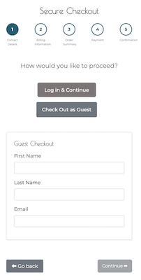
 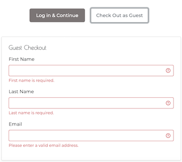

---

### Step 2: Billing Information

**Form Behavior:**

  - Fields are auto-filled for authenticated users using their saved profile data.
  - Guest users must enter billing details manually.
  - Form is loaded dynamically via AJAX to reflect real-time profile updates.


**Live Validation:**

  - All required fields are validated in real time as the user types.
  - Country-specific postcode formats are validated using regex.
  - The Continue button remains disabled until all fields are valid.
  - Security & UX Defenses


**Security & UX Defenses**

| Type                    | Feature                                                                       |
|-------------------------|-------------------------------------------------------------------------------|
| CSRF Protection	        | All billing form submissions include CSRF tokens.                             |
| Backend Validation	    | Billing fields are validated and sanitized before saving.                     | 
| Frontend Validation	    | Includes field-specific error messages and visual validation feedback.        |
| Regex Postcode          | Validation	Validates postcode based on selected country (e.g., IE, GB, DE    |
|                         | etc.).                                                                        |
| Disabled Buttons	      | Continue button only activates if all fields are valid.                       |
| Dynamic Rendering	      | Billing form is only injected at the billing step via AJAX.                   |
| Modal Confirmation	    | Save/discard prompt shown if user attempts to proceed after changes.          |
| Revert Unsaved Edits	  | Users can cancel and restore original field values.                           |
| ARIA & Label Compliance |	Each input has aria-labelledby for screen reader accessibility.               |

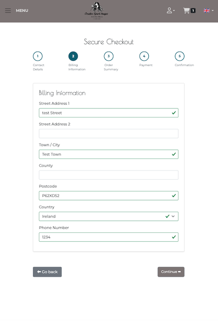 

---

### Step 3: Order Summary

**Form Behavior:**

Structured Summary View:
  - Displays entered Contact Details and Billing Information, each with a Change button that redirects back to Step 1 for real-time editing.
  - Dynamically pulls contact and billing info from session data or authenticated user's profile (UserProfile model).

Bag Contents lists all cart items from the session-stored bag with:
  - Product image (on the left)
  - Product title, format (digital/printed), license, print type, and quantity (on the right)
  - Responsive layout with image next to content from min-width: 400px+

Special Offer Display:
  - Dynamically fetches and displays the most recent active special offer (if one exists) from the SpecialOffer model.
  - Highlighted in a green alert box.

Price Breakdown:
  - Shows a clear breakdown of:
  - Subtotal (excl. VAT)
  - VAT (based on user’s billing country)
  - Shipping (based on printed product type and location)

Total (calculated and rounded consistently)
  - Responsive UI
  - Product image and text adapt across breakpoints.
  - Responsive margin utilities like me-md-3 ensure clean layouts on larger screens.

Navigation:
  - ⬅ Go back button redirects to shopping bag.
  - Proceed to Secure Payment ➡ leads to Step 4: Payment.

Responsive Layout:
  - The order summary is split into a left (form data) and right (summary) column inside a Bootstrap card. On smaller screens, it stacks vertically.

Individual Line Totals and Per-Unit Price Indication:
  - Each product row shows the per-unit-price as well as the line total ensures price transparency and make it easy for the customer to identify and check their order's eligibilty for a discount.

Discount Block Styling:	
  - Special offers are shown in banner-style including a row clearly stating the value saved.

Responsive Layout with flex-wrap:
  - The .flex-wrap class ensures that the summary adapts cleanly across screen sizes and prevents layout breakage.

Subtotal, VAT, Shipping, and Total:
  - Financial breakdown shown with precision (floatformat:2) and are visually separated for better readability.

Floating "Secure Payment" Button:
  - Final CTA button updates dynamically via JS, gets styling and icon to indicate secure checkout visually.

Live Step Transition via AJAX: 
  - All content (including summary) is loaded using asynchronous requests (fetch()), allowing faster interaction without full reloads.

### Security & UX Defenses

| Type                    | Feature                                                                       |
|-------------------------|-------------------------------------------------------------------------------|
| CSRF Protection         | CSRF tokens included in all forms via `RequestContext` and `` |
| Session Handling        | Contact, billing, and cart data stored in session or pulled from authenticated user |
| Progress Indicator      | Visual progress bar guides user through multi-step process                    |
| Change Buttons          | Allow users to return and edit previous steps without losing form state       |
| Responsive Layout       | Bootstrap grid ensures mobile-friendly alignment of images and form fields    |
| Validation (Client)     | JavaScript validation for email, phone number, and country-specific postcodes |
| Validation (Server)     | Django form and model validation for contact, billing, and bag data integrity |
| Fallback Mechanisms     | VAT and shipping defaults applied if no user country or matching rate found   |
| Error Handling          | AJAX and form errors surfaced clearly with `alert` messages or modals         |
| Number Formatting       | Prices consistently formatted with 2 decimal places for clarity and trust     |
| DOM Sanitization        | All order summary content rendered server-side and loaded via AJAX for safety |
| Live Step Transitions   | Prevents data duplication or stale state using dynamic step loading (AJAX)    |
| Accessibility Support   | ARIA roles and labels improve usability for screen readers and keyboard users |
| Discount Integrity      | Discount and total amounts are re-validated server-side at summary stage      |
| Secure Payment Feedback | Final CTA labeled clearly and styled with lock icon to indicate HTTPS trust   |


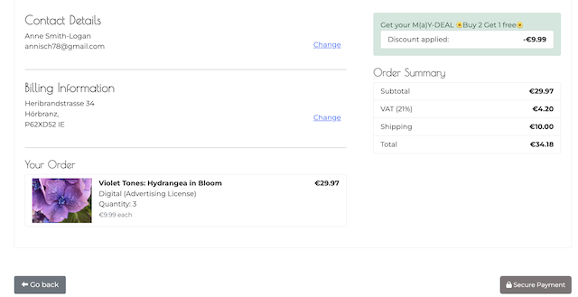

---

### Step 4: Payemnt

**Features**
- Integrated [Stripe Checkout](https://stripe.com/docs/checkout) to handle secure payments.
- Product data (title, quantity, price, image) dynamically passed to Stripe session.
- Stripe session created server-side and client is redirected to hosted payment page.
- Payment confirmation handled via a secure webhook.
- Checkout success clears cart and renders a thank-you page.

**Form Behaviour**
- The “Continue” button becomes the **Secure Payment** button on the order summary step.
- Stripe public key passed to JS using `<body data-stripe-public-key="{{ STRIPE_PUBLIC_KEY }}">`.
- `checkout_script.js`:
  - Initializes Stripe
  - Handles the final payment step
  - Redirects users on session creation
  - Stripe session is initiated via AJAX (`fetch('/checkout/create-checkout-session/')`).
  - Stripe success and cancel URLs are dynamically built and defined in the session.

**Stripe Form Customisation**
Stripe Checkout was styled to visually match the project using:
  - Logo: Custom store logo added
  - Colors: Brand primary and accent colors set to match the site palette
  - Font: Montserrat (same as site typography)
  - Shape: Rounded buttons for consistency with UI elements

**⬅ Cancel Button Behavior :**
  - Customized default Stripe “←” back links to redirect users to the Order Summary page for a seamless experience.

---

### Security & UX Defenses

| Type                      | Feature                                                                                     |
|---------------------------|---------------------------------------------------------------------------------------------|
| Secret Management         | Stripe secret keys and webhook secrets stored securely in `env.py` and Heroku Config Vars. |
| Webhook Verification      | Incoming webhooks validated with `stripe.Webhook.construct_event()` to prevent forgery.     |
| Cancel Button UX          | Stripe cancel button redirects back to the Order Summary instead of default fallback page.  |
| Local Webhook Testing     | Ngrok tunnel used for secure HTTPS testing with static authenticated domain.                |
| Visual Consistency        | Stripe Checkout branded with same fonts, colors, rounded shapes, and logo as store UI.      |


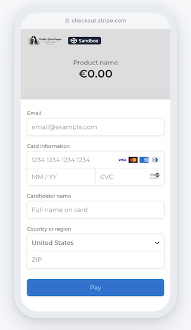

---

### Step 5: Confirmation


---
---

### Custom 404 Page

The project includes two custom 404 pages:

- **404.html** is rendered when a requested route does not match any defined URL pattern, or when an error occurs preventing a view from responding correctly, resulting in a "Page Not Found" response.

- **page_under_construction.html** 
  - A single 404-style “Coming Soon” page is shared across all languages.
  - Language is determined via ?lang= query string (e.g. ?lang=de, ?lang=fr, ?lang=es).
  - Translations are handled on the client-side using JavaScript.
  - The feature includes a language dropdown in the navbar that links users to the under-construction page with the correct language flag and content.

---
---

## Features Left to Implement

- Rating and comment system for products
- Image zoom/lightbox on product detail
- SEO optimization and sitemap auto-generation
- Instagram feed integration

---
---

## The Admin Panel

- Summary:

  Admins can:
  - Add/edit products, licenses, and print types
  - View and manage orders via OrderModel
  - Manage stock levels
  - Add featured products and promotions

  Admin is enhanced with:
  - Crispy forms
  - Status filters
  - Automated `order_number` generation

---
---

## Security Features and Error Handling

## Security Features

Security has been a central concern in the development of this application — especially given that it involves user authentication, digital transactions through Stripe, and sensitive user data. The system is built using Django's robust security tools, enhanced with thoughtful implementation to create a secure, trustworthy, and seamless shopping experience.

This project adopts a defensive development strategy, focusing on data integrity, user protection, and controlled access throughout the site. Sensitive workflows such as checkout, Stripe payments, and account handling are fortified with proven security best practices.

### Authentication & Authorization

- **Django's built-in authentication system** is used to enforce user authentication.
- Role-based access control (**RBAC**) differentiates **normal users, staff, and superusers** to limit permissions accordingly.
- **Session expiration & inactivity logout** prevent unauthorized access if a session remains idle for too long.
- **Two-factor authentication (2FA)** can be integrated for additional security.

### **User Management & Account Security**
- **Password hashing using Django’s PBKDF2 algorithm** (configurable with bcrypt, Argon2, or SHA-256) to secure stored credentials.
- **Brute-force protection** via login attempt throttling to prevent repeated unauthorized login attempts.
- Users must use **strong passwords**, enforced through Django’s built-in **password validators**.
- **Email verification** is required for new account activation and password resets.
- **Cross-Site Request Forgery (CSRF) protection** is enabled for all sensitive user actions.

### Form & Input Validation

- All form inputs are cleaned and validated before saving to the database.
- CSRF protection is enforced via Django’s automatic CSRF token inclusion on all forms to prevent cross-site attacks.
- The system uses try-except blocks to gracefully catch and handle edge cases like invalid quantity or missing data during form submission.

### Stripe Integration Security

- The Stripe payment gateway is integrated using environment variables to protect secret keys.
- Stripe checkout sessions are server-side generated, ensuring users cannot manipulate payment data client-side.
- All sensitive payment interactions happen on Stripe’s secure hosted pages, reducing PCI compliance risks.

### Data Protection & ORM Use

- **Form validation** prevents SQL injection, XSS (Cross-Site Scripting), and malicious inputs.
- All input fields are sanitized before being stored in the database.
- **Django ORM (Object-Relational Mapping)** is used instead of raw SQL queries to prevent SQL injection attacks.
- **File uploads are restricted** to specific formats, and **size limits** are set to prevent abuse.
- **Sensitive data is encrypted** before being stored, using Django’s **encrypted fields** or third-party libraries like **Fernet encryption**.

### Admin Panel Security

- **Admin panel access is restricted** to superusers and staff members.
- **Recent admin actions are logged**, allowing audits for tracking changes.
- **Bulk actions (delete, approve, mark verified)** require confirmation to prevent unintended modifications.
- **Only verified email addresses** can be assigned as primary to prevent account impersonation.
- **Superusers receive notifications for suspicious activity** within the admin panel.

### **Database Integrity Protection**
- **Foreign key constraints** ensure related data is properly linked and prevent orphan records.
- **Transactional integrity** is enforced using Django’s **atomic transactions** to prevent partial data updates in case of failure.
- **Backups & automatic rollbacks** are scheduled to recover from accidental data loss or corruption.

### **Logging & Monitoring**
- **Django’s logging framework** is configured to track authentication attempts, errors, and suspicious activity.
- **Error logs are monitored in real-time**, and alerts are triggered for repeated failed login attempts or unusual API usage.
- **Third-party security monitoring tools**, such as Sentry, can be integrated to capture and analyze security breaches.

### Other Protections

- Hidden form fields are validated server-side to ensure users don’t manipulate hidden product configuration values like license type or print format.
- Checkout sessions are cleared immediately after successful order placement, preventing re-submission or reuse of the cart.
- Null-safe access to all optional values (e.g., license or print_type) prevents unexpected crashes in cart or checkout logic.

---

## Error Handling

This project uses clear, user-friendly messaging and fallback logic to maintain a smooth experience, even when unexpected errors occur.


### **Form & Input Validation Errors**

- User input validation provides **real-time feedback** to prevent incorrect submissions.
- Custom **error messages** guide users toward resolving input issues.
- **Try-except blocks** handle unexpected form errors gracefully.

### **Authentication & Access Errors**

- Unauthorized users attempting to access restricted pages are **redirected to the login page with an error message**.
- **403 Forbidden and 401 Unauthorized responses** are properly returned in the API when access is denied.
- **Invalid login attempts are logged**, and users are notified of suspicious login activity.
- **Attempts to bypass restrictions** are gracefully denied with messages, not crashes.

### **Database & Model Errors**

- **Atomic transactions** prevent database corruption by rolling back failed operations.
- **Custom error handlers** catch and display meaningful error messages when database operations fail.
- **Graceful handling of missing database records**, preventing "DoesNotExist" exceptions.

### Fallback for Missing Data

- If product data or stock details are missing, users are shown friendly warnings rather than raw errors.
- The system validates session data before using it, preventing “NoneType” or invalid cast exceptions.

---
---

## Page Performance

  ### Mobile

- Home Page


- Category Page


- Recipe Detail Page


- About Page


- Weekly Tip


- Page for Login / Logout / Sign-Up


  ### Desktop

- Home Page


- Category Page


- Recipe Detail Page


- About Us Page


- Contact Page


- Page for Login / Logout / Sign-Up


---
---

## Testing

### Manual Testing

To catch and be able to reverse an action before being forced to wipe the database I made sure to strictly following the concept of model first and test the functionality with print statements to the terminal and compiling a tests file for each app.

I confirmed that all errors caused by user action are handeled the expected way and the corresponding feedback messages are given to the user by entering invalid inputs

- Add to cart (with/without license or print type)
- Remove from cart
- Quantity updates
- Stripe checkout end-to-end
- Webhook confirmation with test payloads
- Error message display for edge cases
- Missing print type/stock/out of range conditions

I had content reviewed by test users so I catch and fix typos and/or grammar errors.

I thoroughly tested all buttons, carousel and scroll-down-icon on both mobile devices, tablets and desktop.

Together with my test users (age 25 - 74) I reviewed the content on different devices to ensure all of the content is displayed as expected.

---

### Automated Testing

- Pylint/Flake8 compliance (PEP8 style fixes implemented)
- Unit tests on views and utility functions (`calculate_total_price`)
- Repeated regression testing after bag and checkout integration

---

### Test Report Django

  ```bash
  shop/tests/test_models.py
  Found 6 test(s).
  Creating test database for alias 'default'...
  System check identified no issues (0 silenced).
  ......
  ----------------------------------------------------------------------
  Ran 6 tests in 3.395s

  OK


  user_profiles/tests/test_models.py

  Found 3 test(s).
  Creating test database for alias 'default'...
  System check identified no issues (0 silenced).
  ...
  ----------------------------------------------------------------------
  Ran 3 tests in 1.575s

  OK


  user_profiles/tests/test_admin.py

  Found 1 test(s).
  Creating test database for alias 'default'...
  System check identified no issues (0 silenced).
  .
  ----------------------------------------------------------------------
  Ran 1 test in 1.659s

  OK


  user_profiles/tests/test_form.py

  Found 2 test(s).
  Creating test database for alias 'default'...
  System check identified no issues (0 silenced).
  ..
  ----------------------------------------------------------------------
  Ran 2 tests in 0.451s

  OK


  user_profiles/tests/test_views.py

  Found 2 test(s).
  Creating test database for alias 'default'...
  System check identified no issues (0 silenced).
  ..
  ----------------------------------------------------------------------
  Ran 2 tests in 2.647s

  OK

  user_profiles/tests/test_signals.py

  Found 2 test(s).
  Creating test database for alias 'default'...
  System check identified no issues (0 silenced).
  ..
  ----------------------------------------------------------------------
  Ran 2 tests in 0.987s

  OK


  Final test after implementing all features

  Found 10 test(s).
  Creating test database for alias 'default'...
  System check identified no issues (0 silenced).
  ..........
  ----------------------------------------------------------------------
  Ran 10 tests in 8.551s

  OK
  ```

---
---

### Bugs and Resolutions

  | Bug / Issue | Description | Resolution |
  |-------------|-------------|------------|
  | `ModuleNotFoundError` for `bag.context_processors` | Typo in the context processor path led to an internal server error on homepage load. | Corrected the import path in `settings.py` to properly reference `bag.context_processors.bag_contents`. |
  | Quantity was not passed in `POST` request | Resulted in `NoneType` error during `add_to_bag` view. | Added a hidden quantity field and ensured `name="quantity"` was included in the form. |
  | Incorrect `if` template logic in `bag.html` | Used `` without a condition, causing a TemplateSyntaxError. | Replaced `` with `` to correctly handle the conditional. |
  | Printed product was added as digital | Format input was not updated when selecting "Printed Product". | Ensured `formatInput.value` is updated in the JS toggle logic and added the `formatInput` field inside the `<form>`. |
  | Remove button in bag failed | Reverse URL lookup for `remove_from_bag` failed due to incorrect argument. | Updated `remove_from_bag` view to use composite `item_key` and passed it correctly in the template with ``. |
  | Print type showed as "None" | Printed product selection was not saved properly. | Corrected logic in view to capture and store the print type string instead of its raw or empty value. |
  | Duplicate field assignments | Variables like `product_format`, `license_id` were declared twice. | Cleaned up `add_to_bag` view to assign each value once and added necessary try-except blocks for safety. |
  | Quantity not accumulating | Items were overwritten instead of updated when re-added. | Switched from product ID key to composite `item_key` in the session to distinguish variations. |
  | Facebook page not linked correctly in Instagram | Page didn’t show under Accounts in Instagram. | Resolved via Meta’s **Accounts Center** by properly connecting Facebook Page under "Connected Experiences". |
  | Stripe `checkout_success` crashed on OrderModel save | `user_id` was missing due to anonymous session. | Required login before checkout and passed `request.user` when saving the order. |
  | `product_format` showed as `None` in bag | JS toggle logic did not update hidden input properly. | Ensured `formatInput.value` is correctly set on both radio button changes. |
  | Shopping bag displayed nothing after adding product | Key logic broke due to mismatch between view and template. | Made sure both view and template used the same composite `item_key` structure. |
  | View crashed due to `b` typo | Typo in `remove_from_bag` function: `b else:` instead of `else:`. | Fixed syntax error by removing stray character and fixing indentation. |
  | Shipping costs not appearing | Incorrect `product_type` used for ShippingRate query| Mapped `print_type` to correct lowercase keys using `PRINT_TYPE_TO_SHIPPING_TYPE` |
  | Shipping displayed as €0.00 despite valid config | Print type defaulted silently to first in list | Added `---` placeholder and enforced user selection |
  | VAT always showed 0% | VAT lookup failed due to missing country session value | Added fallback and ensured country is set in session |
  | Buttons didn’t disable after selection changes | No JS logic tracking pending updates | Introduced `data-pending-update` attributes and validation logic |
  | Proceed to Checkout remained active | JS didn’t sync with all forms | Check across all forms before enabling the checkout button |
  | Buttons misaligned on mobile | Layout didn’t account for responsive wrapping | Used Bootstrap classes to stack buttons on small screens |
  | Image not resizing | Fixed height and inline styles limited image height | Replaced inline styles and used flexbox with min-height |
  | Order total recalculated incorrectly in checkout | View re-calculated totals instead of using pre-calculated bag data. | Added session-level calculation and passed it to OrderModel creation. |
  | `request.user` not passed in `OrderModel` | Attempted to save an order without an authenticated user. | Added `login_required` decorator to ensure only logged-in users can complete checkout. |
  | Stripe webhook email not received | Email address was missing from test payload. | Ensured `customer_email` was included in Stripe session and template. |
  | `Uncaught TypeError: Cannot read properties of null (reading 'style')` | JavaScript attempted to access `.style` on DOM elements that were not present on some pages (e.g., `#backToTop`, `#message-container`). | Added `if (element)` checks before accessing `.style` or attaching event listeners to ensure scripts run safely across all pages. |
  | `NoReverseMatch at /` | `` was used without registering the corresponding view in `urls.py`. | Created a Django view for `page_under_construction` and added a named URL pattern. |
  | `Uncaught ReferenceError: Cannot access 'translations' before initialization` | JavaScript attempted to access the `translations` object before it was defined using `const`. | Reordered code to define `translations` before using it. |
  | Language selection always showed English | Language was hardcoded in JavaScript (`const lang = 'en'`) instead of being dynamically detected. | Re-enabled `detectLang()` to read from `?lang=` query parameter or browser settings. |
  | `Uncaught TypeError: Cannot set properties of null (setting 'textContent')` | JavaScript tried to update elements that didn’t exist in the DOM because `` was missing or script ran before DOM loaded. | Wrapped content in `` and deferred DOM updates using `DOMContentLoaded`. |
  | Flag icon didn't match selected language | The navbar flag was hardcoded to the UK flag. | Added logic to update the flag image based on selected language using JavaScript and query parameters. |
  | UK flag disappeared from language dropdown | English was only used in the toggle button, not listed as an option. | Added English back into the dropdown list with the appropriate flag and label. |
  | Bug / Issue | Description | Resolution |
  | Modal infinite loop | Clicking "Continue" after a cancelled or skipped save reopened the modal | Tracked user intent using flags and dataset attributes to conditionally redirect |
  | Modal not closing | Clicking "Save" did not close modal despite successful save | Refactored save handler to close modal on successful response |
  | Error displayed despite success | Modal still showed "Unable to save profile" even when save succeeded | Ensured error alert is cleared upon success and modal is hidden |
  | Duplicate profile error | Guest user triggered `IntegrityError` if profile already existed | Replaced `create()` with `get_or_create()` to ensure uniqueness |
  | Guest login failed | Guest users caused error due to missing authentication backend | Explicitly set backend before calling Django’s `login()` |
  | Email validation missing | Guest form accepted invalid email addresses | Added regex-based email validation before enabling "Continue" button |
  | Continue enabled too early | Guest users could click "Continue" before completing the form | Added dynamic validation to monitor input fields and disable button if any are invalid |
  | Profile changes not reverted | Authenticated users clicking "Don't Save" saw their edits remain in the form | Reset form fields to original values by re-inserting captured initial data |
  | Pre-filled data not displayed | Billing form did not display saved profile data for authenticated users  | Used `initial.billing_*` context properly in the template                 |
  | Email field accepted `.c`     | Regex allowed incomplete top-level domain in guest form                  | Updated email regex to require TLD with 2+ characters                     |
  | No field-level error feedback | Form didn’t provide immediate input feedback                             | Added `invalid-feedback` elements and real-time input validation          |
  | Continue enabled on invalid input | Button could activate before form was valid                          | Bound validation logic to real-time listeners and checked on render       |
  | Country select didn’t persist | Selected country not marked as `selected` in dropdown                    | Used `selected`        |
  | Missing Template Filter | Template filter `get_item` caused `TemplateSyntaxError` in `checkout_summary.html`.            | Removed or replaced `get_item` usage with direct dictionary access or correct filter logic. |
  | No Timestamp on Request | AttributeError: `'WSGIRequest' object has no attribute 'timestamp'` during offer lookup.       | Replaced `request.timestamp` with `timezone.now()` from Django utilities.                   |
  | Favicon 404             | Browser auto-requested `/checkout/favicon.ico`, resulting in a 404 error.                      | Added a `favicon.ico` in the static directory and linked it via `<link rel="icon">`.        |
  | CSRF Token Warning      | Warning about missing `` context in guest form template load.                  | Ensured `RequestContext` is used in AJAX template rendering via `render_to_string`.         |
  | Price Format Inconsistency | Some totals were displayed as `€0` instead of `€0.00`.                                         | Applied `floatformat:2` in the Django template to ensure all monetary values show two decimals. |
  | `get_item` filter error             | Template error due to undefined custom filter `get_item`                                    | Removed custom template logic and used native Django context rendering                       |
  | `request.timestamp` not found       | Attempted to access non-existent attribute `request.timestamp`                              | Replaced with `timezone.now()` in views.py to fetch current timestamp reliably              |
  | `` warning          | Warning shown due to missing `RequestContext` when rendering guest form                     | Ensured all form views use `RequestContext` and context processors properly configured       |
  | Favicon 404                         | Missing `favicon.ico` request caused 404 errors in dev logs                                 | Added a `favicon.ico` static file and linked it in base template                            |
  | Missing card layout in summary      | Order Summary section lacked consistent visual card styling used in previous steps          | Wrapped entire summary content inside Bootstrap `.card` container with padding and shadow   |
  | Buttons breaking layout             | Proceed/Back buttons appeared too large or shared borders on small screens                  | Updated with responsive width classes and spacing utilities (`w-auto`, `gap-2`, etc.)       |
  | Progress bar hidden at Step 3       | Summary step loaded via AJAX but didn’t re-render the tracker                               | Extracted progress markup to a shared include and injected with context-aware highlighting   |
  | Buttons not responsive              | Buttons didn’t resize proportionally or maintain readability on smaller screens             | Used flexbox (`d-flex`, `gap-2`, `w-auto`) and removed fixed sizing                         |
  | AJAX missing on Step 3              | Step 3 (summary) was previously rendered via redirect, losing dynamic step state            | Implemented full AJAX loading of Step 3 with updated progress and button handling           |
  | Webhook failures          | 400/404 errors in Stripe dashboard when using dynamic Ngrok URLs           | Replaced with a static Ngrok domain and re-authenticated the tunnel       |
  | Stripe session unverified | Webhook didn’t validate signature on localhost                             | Correct `STRIPE_WH_SECRET` used and token passed securely                 |
  | Print statement silent    | `print('✅ Payment received:', session)` not visible in production logs     | Print removed, replaced with proper logging and DB order creation routine  |


---
---

## Technology Stack

- **Backend:** Python 3, Django 4.2
- **Frontend:** HTML5, CSS3, Bootstrap 5, JavaScript
- **Database:** PostgreSQL
- **Media Hosting:** Cloudinary
- **Payment Integration:** Stripe
- **Email Notifications:** Zapier + SendGrid
- **Deployment:** Heroku

---
---

## Code Quality and Version Control

- PEP8 Compliance: The code has been checked against PEP8 standards using .Flake8, .autopep8 and Pylint

- Comments: Functions and classes include docstrings to describe their purpose, inputs, and outputs.

- Version control is managed using Git and GitHub, with a focus on maintaining a clean and organized history. Regular commits follow a consistent format and describe the features implemented and/or reasons for changes made to existing features.

---
---

## Deployment

This project is hosted on Heroku

  **Fork or Clone the repository**

1. Clone the repo:
    ```bash
    git clone https://github.com/yourusername/creative-spark-images
    cd creative-spark-images

2. Create a virtual environment:
    ```bash
    python3 -m venv .venv
    source .venv/bin/activate

3. Install dependencies:
    ```bash
    pip install -r requirements.txt

    # List of dependencies
    asgiref==3.8.1
    bleach==6.2.0
    certifi==2025.1.31
    cffi==1.17.1
    charset-normalizer==3.4.1
    cloudinary==1.36.0
    crispy-bootstrap5==0.7
    cryptography==44.0.2
    defusedxml==0.7.1
    dj-database-url==0.5.0
    dj3-cloudinary-storage==0.0.6
    Django==4.2.20
    django-admin-list-filter-dropdown==1.0.3
    django-allauth==0.57.2
    django-countries==7.2.1
    django-crispy-forms==2.3
    django-summernote==0.8.20.0
    gunicorn==20.1.0
    idna==3.10
    oauthlib==3.2.2
    packaging==24.2
    psycopg2-binary==2.9.10
    pycparser==2.22
    PyJWT==2.10.1
    python3-openid==3.2.0
    requests==2.32.3
    requests-oauthlib==2.0.0
    setuptools==75.8.2
    six==1.17.0
    sqlparse==0.5.3
    stripe==11.6.0
    typing_extensions==4.12.2
    urllib3==1.26.20
    webencodings==0.5.1
    whitenoise==6.5.0


4. Set up .env with:
    ```bash
    SECRET_KEY=
    DEBUG=False
    DATABASE_URL=
    STRIPE_PUBLIC_KEY=
    STRIPE_SECRET_KEY=
    STRIPE_ENDPOINT_SECRET=
    CLOUDINARY_URL=

5. Apply migrations:
    ```bash
    python3 manage.py makemigrations
    python3 manage.py migrate

6. Collect static files:
    ```bash
    python3 manage.py collectstatic

7. Create a PPROCFILE:
    ```bash
    python manage.py > Procfile

8. in settings.py
    ```bash
    DEBUG = FALSE

8. Deploy to Heroku or similar:
    ```bash
    Set up environment variables in Heroku dashboard
    Link GitHub repo
    Enable automatic deploys

> The live link can be found here: 

---
---

## Usage

  - Launch the site and browse the gallery
  - Select a product, choose format and quantity
  - Add to cart and proceed to secure checkout
  - Receive confirmation and follow-up via email

---
---

## Contribution

  - Fork the repo
  - Create a new branch (git checkout -b feature-name)
  - Make your changes
  - Commit (git commit -m 'Add feature')
  - Push to branch (git push origin feature-name)
  - Open a Pull Request

---
---

## Acknowledgements

### Content

- Stripe Docs for checkout and webhooks
- all legal documents, T&C and policy documents are taken from my existing shop with Picfair whcih this new shop is going to replace
- Stack Overflow and Django community for troubleshooting
- Code Institute project templates for structure inspiration [p3-template](https://github.com/Code-Institute-Org/p3-template)

### Media
- placeholder images:  Freepik https://www.freepik.com/free-photos-vectors
- Icons from my Icon Kit on [font-awesome](https://fontawesome.com/icons)
- all images and videos are my own

---
---

## Author

- [merzann](https://github.com/merzann)

---
---

## License
[](LICENSE.md)